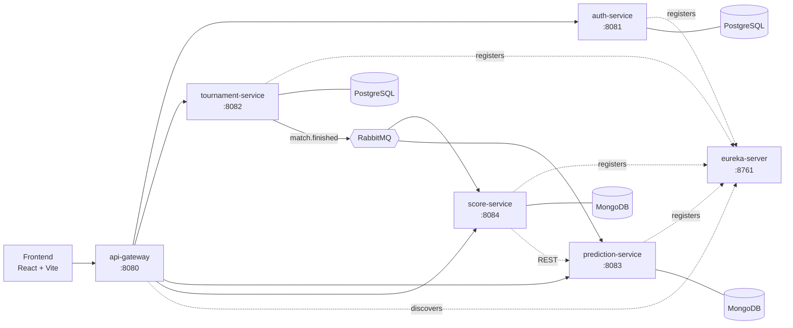

# ScoreGrid

A football prediction pool ("Prode") built as a distributed system. Admins create tournaments with group stages and knockout phases; participants predict match scores; the system scores every prediction automatically and maintains per-tournament and global rankings.

Five Spring Boot business services, a Eureka registry, a React frontend, PostgreSQL and MongoDB, RabbitMQ, and a full local Docker Compose environment.

> **Status:** Feature-complete baseline verified locally. The backend suites, frontend lint/build, Docker images, Compose health checks, Eureka registration and Gateway routing have been exercised. The contracts document is frozen.
>
> Read [`docs/PRD.md`](docs/PRD.md) and [`docs/contracts.md`](docs/contracts.md) before writing code. The contracts document is frozen.

| Stream | Owner | Scope |
|--------|-------|-------|
| A — Identity, Edge & Platform | **Bernard** | `auth-service`, `api-gateway`, Compose, observability, CI, frontend foundation |
| B — Tournament Core | **Paggi** | `tournament-service` and every tournament/admin screen |
| C — Predictions & Scoring | **Werlen** | `prediction-service`, `score-service`, prediction and result screens |

---

## Why it exists

A prediction pool works fine on paper for one round of matches. A tournament with a group stage and knockouts is 30–60 matches; twenty participants produce over a thousand predictions. Every result the organiser enters means recomputing every affected prediction, the tournament table, and a historical cross-tournament table. Spreadsheets get this wrong silently, and nobody notices until someone disputes a standing.

ScoreGrid holds the fixture, the predictions, the scoring and the standings in one place, and recomputes them the moment a result lands.

---

## Architecture



| Service | Responsibility | Database |
|---------|----------------|----------|
| `eureka-server` | Service registry and discovery | — |
| `api-gateway` | Single entry point, routing, edge JWT validation, CORS | — |
| `auth-service` | Users, roles, JWT issuance | PostgreSQL |
| `tournament-service` | Tournaments, teams, groups, phases, matches, results, enrolments | PostgreSQL |
| `prediction-service` | Predictions, kickoff lock, one-per-user-per-match | MongoDB |
| `score-service` | Scoring, tournament ranking, global ranking | MongoDB |

Every service owns its database. No service ever connects to another service's schema — data crosses boundaries through APIs and events only.

**The core flow:** admin loads a result → `tournament-service` publishes `match.finished` → `score-service` fetches the match's predictions, awards 3 points for an exact score and 1 for the right outcome, and recomputes both rankings. Scoring is idempotent, so a corrected result or a redelivered message produces the same numbers, never doubled points.

---

## Quick start

**Prerequisites:** Docker Desktop, Java 21, Node 22.

```bash
git clone <repo> scoregrid && cd scoregrid
cp .env.example .env

# Generate a real JWT secret
openssl rand -base64 48    # paste into SCOREGRID_JWT_SECRET in .env

docker compose up -d --build
```

Wait for all containers to report healthy:

```bash
docker compose ps
```

### Day-to-day: databases in Docker, services from the console

Most of the time you do not want the full set of JVMs in containers. Start the infrastructure only and run the service you are working on directly — it picks up the right database, user and port from `application.yml` with no environment set up:

```bash
docker compose up -d postgres mongodb rabbitmq

cd services/auth-service && ./mvnw spring-boot:run
```

Storage is one Postgres container and one MongoDB container, each holding one database per service with its own login. See [`docs/start.md`](docs/start.md#one-instance-per-engine-one-database-per-service) for why, and for how to re-provision.

| What | Where |
|------|-------|
| Frontend | http://localhost:3000 |
| API gateway | http://localhost:8080 |
| API docs (aggregated) | http://localhost:8080/swagger-ui.html |
| RabbitMQ management | http://localhost:15672 |

With the observability stack:

```bash
docker compose --profile observability up -d
```

| What | Where |
|------|-------|
| Grafana | http://localhost:3001 |
| Prometheus | http://localhost:9090 |

Observability sits behind a Compose profile so ordinary development does not cost an extra 2 GB of RAM.

### Working on one service

Each service is independently buildable — no aggregator POM, no build order.

```bash
cd services/tournament-service
./mvnw test
./mvnw spring-boot:run
```

Integration tests use Testcontainers and start real PostgreSQL, MongoDB and RabbitMQ instances. Docker must be running.

---

## Repository layout

```
scoregrid/
├── .github/workflows/     CI: Eureka + five services, frontend, compose validation
├── docs/                  PRD, setup guide, frozen contracts, work split
├── infra/                 database provisioning + Prometheus, Grafana, Loki, Promtail
├── services/              six independently buildable Maven projects
│   ├── eureka-server/
│   ├── api-gateway/
│   ├── auth-service/
│   ├── tournament-service/
│   ├── prediction-service/
│   └── score-service/
├── frontend/              Vite + React 19 + TypeScript + the design system
├── compose.yaml
├── .env.example
├── AGENTS.md              instructions for AI coding agents
└── CLAUDE.md → AGENTS.md
```

Services are organised hexagonally, by feature first and layer second — open a source root and you see what the service *does*, not which framework it uses. The layout and the three rules that keep it honest are in [`docs/start.md`](docs/start.md#inside-a-service).

---

## Documentation

| Document | Read it when |
|----------|--------------|
| [`docs/PRD.md`](docs/PRD.md) | You need to know what the system does, what it deliberately does not do, and why the design is what it is |
| [`docs/start.md`](docs/start.md) | You are setting up the repository, generating a service, or wondering which Spring dependency to add |
| [`docs/contracts.md`](docs/contracts.md) | **Before writing any code that crosses a service boundary.** Frozen — changes need all three developers to approve |
| [`docs/workstreams.md`](docs/workstreams.md) | You want to know who owns what and what you can build right now without waiting |
| [`AGENTS.md`](AGENTS.md) | You are pointing an AI coding agent at this repository |

---

## Tech stack

Java 21 · Spring Boot 4.1.0 · Spring Cloud 2025.1.2 · Spring Security (OAuth2 resource server) · Spring Data JPA · Spring Data MongoDB · Flyway · RabbitMQ · Resilience4J · Micrometer / Prometheus / Grafana / Loki · Testcontainers · Maven · React 19 · TypeScript · Vite · Tailwind CSS 4 · shadcn/ui · Docker Compose

The user interface is in Spanish; identifiers, comments, commit messages and API fields are in English. See rule 10 in [`AGENTS.md`](AGENTS.md#4-hard-rules).

Spring Boot 4 renamed several starters (`spring-boot-starter-web` is now `spring-boot-starter-webmvc`, among others). The full list of renames, and why you should generate services from the Initializr rather than hand-writing a POM, is in [`docs/start.md`](docs/start.md#read-this-before-you-generate-anything--boot-4x-renamed-starters).

---

## Contributing

- Conventional commits, scoped by service: `feat(tournament): add group team assignment`
- Branches: `feat/<workstream>-<description>`
- Every PR: tests pass, error responses use the shared envelope, endpoints match `docs/contracts.md` exactly, one reviewer
- Never commit `.env`, credentials, or keys
- Never edit a Flyway migration that has been pushed — add a new one

The full definition of done is in [`docs/workstreams.md`](docs/workstreams.md#working-agreements).
