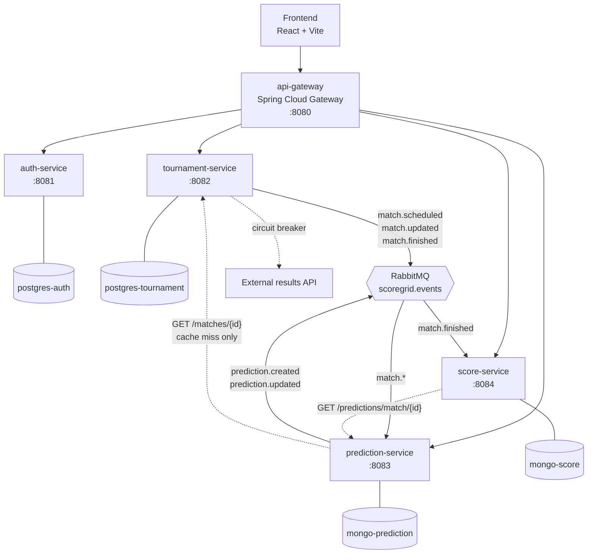

# PRD: ScoreGrid

**Status:** Approved for build
**Audience:** Engineering (primary), project reviewers
**Version:** 1.0
**Source:** `ScoreGird.docx` — "ScoreGrid — Propuesta de Proyecto y Detalle de Arquitectura"

---

## Version History

| Version | Date | Summary of changes |
|---------|------|--------------------|
| 1.0 | 2026-07-26 | Initial mapping of the source proposal. Four source contradictions resolved (see [Resolved Decisions](#resolved-decisions)). |

---

## TL;DR

- **What:** A distributed web application for running football prediction pools ("Prode"). Admins build tournaments with group stages and knockout phases; participants predict match scores; the system scores predictions automatically and maintains per-tournament and global rankings.
- **Why:** Running a multi-stage prediction pool by hand — fixtures, groups, knockouts, dozens of participants, accumulated rankings — stops being practical past a handful of matches. There is no single place holding fixture, predictions, points and standings.
- **Expected outcome:** A working microservices system where an admin can go from empty database to an active tournament with a live ranking, and a participant can predict, get scored and see their position without any manual bookkeeping.

---

## Problem

The Prode is a familiar social game: predict match outcomes, earn points, compare against friends. It works fine on paper for a single round of matches.

It falls apart at scale. A tournament with a group stage plus knockouts has 30–60 matches. Twenty participants produce 600–1200 predictions. Every result the organiser loads means recomputing every affected prediction, updating the tournament table, and updating a historical cross-tournament table. Spreadsheets get this wrong, silently, and nobody notices until someone disputes a standing.

Affected: tournament organisers (unpaid manual labour, and blame when the maths is wrong) and participants (no reliable, live view of where they stand).

---

## Goals

1. **Tournament structure** — an admin can model a real competition: teams, groups, group-stage matches, knockout phases, and the matches inside them.
2. **Predictions with a hard lock** — a participant submits exactly one prediction per match and may edit it until kickoff. After kickoff it is immutable.
3. **Automatic scoring** — loading a final result triggers scoring of every prediction on that match with no human step.
4. **Two rankings** — a per-tournament ranking and a global ranking accumulating a user's history across all tournaments.
5. **Genuine service separation** — at least three Spring Boot services plus a frontend, each owning its own database, communicating over REST and RabbitMQ, with no cross-service database access.
6. **Polyglot persistence** — at least one SQL and one NoSQL store, each chosen for a stated reason.
7. **Operable locally** — the whole system starts with one `docker compose up`, exposes health checks and metrics, and ships centralised logs.

---

## Non-Goals

Out of scope for the first delivery. Each is a deliberate cut, not an oversight.

- **Automatic knockout bracket generation from group standings** — the admin creates knockout fixtures manually. Deferred: the qualification rules (points, goal difference, head-to-head, fair play) are a project in themselves.
- **Group standings tables** (the sporting table: W/D/L, goal difference) — deferred. The product scores *predictions*, not teams. Nothing else depends on it.
- **Notification service** (email/push for closing predictions, results, ranking moves) — deferred. `prediction.created` / `prediction.updated` events are published in v1 specifically so this service can be added later without touching Prediction Service.
- **Top-scorer / qualified-team prediction types** — the prediction document is schema-flexible to allow them; no scoring path is built.
- **Private tournaments and invitations** — every tournament is visible to every authenticated user.
- **Per-tournament configurable scoring rules** — one rule set, defined below, applied everywhere. The `ScoringRule` abstraction exists so this becomes configuration rather than a rewrite.
- **Horizontal scaling / production deployment** — local Docker Compose only.

---

## Constraints

- **Tech:** Spring Boot microservices, Java. At least three Spring Boot services and one independent frontend. At least one SQL and one NoSQL database. Docker + Docker Compose. RabbitMQ for asynchronous messaging. Resilience4J for fault tolerance.
- **Hard architectural rule:** a service reads and writes only its own database. Data owned by another service is obtained through that service's API or through events — never by connecting to its schema.
- **Team:** three developers working concurrently. This constrains the design as much as any technical requirement: the split into services and the contracts between them must let three people work without blocking each other. See [`workstreams.md`](workstreams.md).

---

## Resolved Decisions

The source document contradicts itself in four places. Each was resolved before writing this PRD; the reasoning is recorded because the alternatives were all defensible.

| # | Conflict in source | Decision | Why |
|---|--------------------|----------|-----|
| 1 | "Alcance delimitado" and the UI mockups show goal inputs per team; §6.6 recommends starting with basic 1X2 | **Exact score input, tiered scoring** | The user always enters home and away goals. Outcome (home win / draw / away win) is *derived* from the score, so 1X2 is a subset — nothing is lost, and it matches the mockups the stakeholder already signed off on. |
| 2 | "Score Service" on MongoDB (Alcance, summary table) vs "Ranking Service" on PostgreSQL (§9.5, §15.4) | **`score-service`, MongoDB** | Follows the delimited scope and the summary table. Rankings are read-heavy denormalised snapshots, which is what a document store is good at. Keeps the polyglot requirement clean: two Postgres, two Mongo. Public endpoints stay `/rankings/**` — the service is named for what it *does*, the endpoints for what they *return*. |
| 3 | API Gateway absent from the delimited scope, present in §8 and §9.1 | **In scope — Spring Cloud Gateway** | One entry point means the frontend holds one base URL, CORS is configured once, and JWT is validated at the edge before a request reaches any service. It also gives the three-way work split a clean seam. |
| 4 | §81 says real results come from an external API with Resilience4J; the Alcance and every flow describe manual admin loading | **Manual loading, plus an external provider adapter behind a circuit breaker** | Manual loading is the guaranteed path and can never fail. The external adapter sits behind a `ResultProvider` port with retry and circuit breaker, so Resilience4J protects something real, and the system never blocks on a third party. |

Standing assumptions, not in the source:

> **Assumption — roles:** two roles in v1, `ADMIN` and `PLAYER`. The source names three (`ADMIN`, `TOURNAMENT_ADMIN`, `PLAYER`), but the delimited scope only ever describes two behaviours. The `roles` / `user_roles` tables are many-to-many, so adding `TOURNAMENT_ADMIN` later is a data change, not a schema change.

> **Assumption — enrolment:** participation in a tournament is explicit. A user joins a tournament before predicting in it. The source implies this ("inscripción o participación en torneos") without specifying it. Without it, "tournaments played" in the global ranking has no definition.

---

## Users and Roles

| Role | Can do |
|------|--------|
| **PLAYER** | Register, log in, browse tournaments, join a tournament, view groups / phases / fixture, create and edit own predictions before kickoff, view results, view own points, view tournament and global rankings. |
| **ADMIN** | Everything a player can, plus: create and configure tournaments, manage teams, create groups, assign teams to groups, create knockout phases, create and edit matches, load real results, view all users. |

A player may only ever read or write **their own** predictions. Rankings are readable by any authenticated user.

---

## Functional Scope

### F1 — Accounts and authentication

Register with username, email and password. Log in and receive a JWT. Retrieve own profile. Passwords are stored BCrypt-hashed; nothing else is acceptable.

### F2 — Tournaments

A tournament has a name, description, start date, estimated end date, status and creator.

Status lifecycle: `DRAFT` → `ACTIVE` → `FINISHED`, with `CANCELLED` reachable from `DRAFT` or `ACTIVE`.

- Structure (teams, groups, phases, matches) is editable in `DRAFT`.
- Players can only join and predict in `ACTIVE` tournaments.
- A `FINISHED` or `CANCELLED` tournament accepts no new matches and no new predictions.

### F3 — Teams

A global team catalogue: name, short name, country, logo URL. Teams are reused across tournaments. A team is linked to a tournament through `tournament_teams`, and may appear in a given tournament **at most once**.

### F4 — Groups

A tournament has zero or more groups (Group A, Group B, …), each with a name and display order, and each holding a subset of the tournament's teams. A team belongs to at most one group per tournament.

### F5 — Knockout phases

A tournament has zero or more phases, each with a type and display order:
`GROUP_STAGE`, `ROUND_OF_16`, `QUARTER_FINAL`, `SEMI_FINAL`, `THIRD_PLACE`, `FINAL`.

Fixtures inside a phase are created manually by the admin (see Non-Goals).

### F6 — Matches

A match belongs to exactly one tournament and to **either** a group **or** a phase — never both, never neither. It has a home team, an away team, a kickoff timestamp, a status, and once played, a score.

Status: `SCHEDULED` → `IN_PROGRESS` → `FINISHED`, with `POSTPONED` and `CANCELLED` as terminal-ish escapes.

Rules:
- Home team and away team must differ.
- Both teams must be registered in the match's tournament.
- If the match is in a group, both teams must be in that group.
- Kickoff must be in the future when the match is created.

### F7 — Predictions

A participant predicts **home goals and away goals**. The 1X2 outcome is derived, never stored as the primary value.

Rules:
- One prediction per (user, match). Enforced by a unique index, not by a read-then-write check.
- Creating or editing requires: the tournament is `ACTIVE`, the user has joined it, the match is `SCHEDULED`, and `now < kickoff`.
- At kickoff the prediction is locked. Any later write is rejected with `409 Conflict`.
- Goals are integers in `0..99`.

### F8 — Scoring

When a match is finished with a real score, every prediction on that match is scored:

| Condition | Points |
|-----------|--------|
| Predicted score equals real score exactly | **3** |
| Outcome (home win / draw / away win) matches but score does not | **1** |
| Outcome does not match | **0** |

Scoring is **idempotent**. Re-running it for a match — because a result was corrected, or because a message was redelivered — produces the same rankings, not doubled points. This is achieved by storing the per-match scoring outcome as a single replaceable document and deriving rankings from those documents, never by incrementing counters.

### F9 — Tournament ranking

Per tournament, per user: points, hits (points > 0), exact hits, predictions scored, and position.

Position is **computed at query time** from a sorted, indexed query, not stored. A stored position is stale the moment another user's match is scored.

Tie-break order:
1. Points, descending
2. Exact hits, descending
3. Hits, descending
4. Predictions scored, ascending (same points from fewer predictions is a better strike rate)
5. Username, ascending

### F10 — Global ranking

Per user, across all tournaments: total points, tournaments played, total predictions scored, total hits, exact hits, average points per tournament. Same tie-break order.

### F11 — Web frontend

React + Vite. Screens: login, register, dashboard, tournament list, tournament detail (groups, phases, fixture), prediction form, my predictions, tournament ranking, global ranking, admin panel, load results.

---

## Architecture

Five deployable backend services and one frontend. Every service owns its database. Nothing shares a schema.

| Service | Port | Owns | Database | Why that database |
|---------|------|------|----------|-------------------|
| `api-gateway` | 8080 | Routing, edge JWT validation, CORS | — | Stateless |
| `auth-service` | 8081 | Users, roles, JWT issuance | PostgreSQL | Users and roles are relational, low-volume, and must be consistent |
| `tournament-service` | 8082 | Tournaments, teams, groups, phases, matches, results, enrolments | PostgreSQL | Seven entities with real referential integrity; foreign keys do the work the application would otherwise do badly |
| `prediction-service` | 8083 | Predictions | MongoDB | The prediction document is designed to grow new prediction types (exact score, top scorer, qualified team) without schema migrations |
| `score-service` | 8084 | Match scores, tournament rankings, global rankings | MongoDB | Rankings are denormalised read-optimised snapshots; a document per ranking entry is exactly the access pattern |

### Communication

**Synchronous REST** for reads the caller needs an answer to right now:
- Prediction Service → Tournament Service: validate a match exists and is still open (only on local cache miss).
- Score Service → Prediction Service: fetch all predictions for a finished match.

**Asynchronous RabbitMQ** for domain facts other services react to. Topic exchange `scoregrid.events`.

| Event | Publisher | Consumer | Purpose |
|-------|-----------|----------|---------|
| `match.scheduled` | tournament | prediction | Populate the local match cache so the kickoff lock needs no network call |
| `match.updated` | tournament | prediction | Kickoff or status changed; refresh the cache |
| `match.finished` | tournament | score | Trigger scoring |
| `prediction.created` | prediction | — | Published for the future notification service |
| `prediction.updated` | prediction | — | Published for the future notification service |
| `score.calculated` | score | — | Audit trail and future notifications |

Full payload schemas are frozen in [`contracts.md`](contracts.md).

### Resilience

| Where | Protection |
|-------|-----------|
| tournament → external results API | Circuit breaker + retry with exponential backoff + timeout + fallback to "no automatic result, admin loads manually" |
| score → prediction (REST) | Circuit breaker + retry. On exhaustion the message is nacked to a dead-letter queue with a delayed retry, so scoring resumes when Prediction Service returns |
| prediction → tournament (REST) | Circuit breaker + retry. Fallback: reject the prediction with `503` rather than accept one that might violate the lock |
| All AMQP consumers | Dead-letter queue per queue; consumers are idempotent so redelivery is safe |

The rule behind all of these: **never accept a write you cannot validate, and never lose an event you cannot yet process.**

### Observability

- Actuator health, readiness and liveness probes on every service; Compose health checks gate startup order.
- Micrometer → Prometheus → Grafana for metrics.
- Structured JSON logs → Promtail → Loki → Grafana for centralised logs.
- Trace ID propagated across HTTP and AMQP so one user action is followable end to end.

---

## Primary Flows

**Admin sets up a tournament**
1. Log in as `ADMIN`.
2. Create the tournament (`DRAFT`).
3. Register teams in the catalogue; add them to the tournament.
4. Create groups; assign teams to groups.
5. Create group-stage matches.
6. Create knockout phases; add matches as they become known.
7. Activate the tournament (`DRAFT` → `ACTIVE`).

**Participant predicts**
1. Register or log in.
2. Browse active tournaments; join one.
3. View groups, phases and fixture.
4. Submit home/away goals for a scheduled match; edit any time before kickoff.
5. After kickoff the form is read-only.

**Result to ranking**
1. Admin loads the final score (or the external provider supplies it and the admin confirms).
2. Tournament Service sets the match to `FINISHED` and publishes `match.finished`.
3. Score Service consumes it and fetches every prediction for the match.
4. Each prediction is compared against the real score and awarded 3 / 1 / 0.
5. The per-match score document is written (replace, not append).
6. Tournament and global rankings are recomputed from score documents.
7. `score.calculated` is published; the frontend shows updated positions.

---

## Edge Cases and Error States

| Situation | Behaviour |
|-----------|-----------|
| Prediction submitted at or after kickoff | `409 Conflict`. Server clock decides, never the browser. |
| Second prediction for the same match | `409 Conflict`. Unique index on `(userId, matchId)`. |
| Prediction for a match in a `DRAFT`, `FINISHED` or `CANCELLED` tournament | `409 Conflict`. |
| Prediction by a user who has not joined the tournament | `403 Forbidden`. |
| Admin corrects an already-scored result | Match is rescored; the per-match document is replaced; rankings recomputed. Totals stay correct because they are derived, never incremented. |
| `match.finished` delivered twice | Second run produces an identical document. No double points. |
| Prediction Service down when a match finishes | Message dead-lettered and retried with delay. Scoring completes late; nothing is lost. |
| External results API down or slow | Circuit opens; the manual path is unaffected. |
| Match cancelled after predictions exist | Predictions are retained but never scored; the match contributes zero to every ranking. |
| Tournament with no finished matches | Ranking returns an empty list, not an error. Frontend shows an empty state. |
| Expired or missing JWT | `401` at the gateway. |
| Player calls an admin endpoint | `403` at the service, not only at the gateway. Defence in depth. |

---

## Non-Functional Requirements

| Requirement | Target |
|-------------|--------|
| Read latency (rankings, fixture) | p95 < 300 ms locally |
| Scoring latency | Ranking reflects a result within 5 s of the admin saving it |
| Availability under partial failure | A down Score Service must not prevent predicting; a down Prediction Service must not prevent fixture browsing |
| Data isolation | Zero cross-service database connections. Enforced by configuration review. |
| Security | BCrypt passwords, JWT auth, role checks at both gateway and service, no secrets committed |
| Extensibility | A new prediction type must not require changing Tournament Service; a new scoring rule must not require changing Prediction Service |
| Startup | `docker compose up` reaches all-healthy with no manual step |

---

## Alternatives Considered

| Option | Rejected because |
|--------|------------------|
| Single Spring Boot monolith | Fails the core requirement, and the four bounded contexts are genuinely independent — scoring rules change far more often than the fixture model. |
| Merge Score Service into Prediction Service | The source itself flags this as acceptable but less clean. Rejected: scoring is where the rules churn, and it needs a read model shaped nothing like the write model for predictions. |
| Score Service maintains a local replica of predictions via events | Removes the synchronous dependency, but any missed event silently corrupts rankings and requires a reconciliation job. Pulling on `match.finished` is always consistent, and the DLQ covers the outage case. |
| Kafka instead of RabbitMQ | Kafka's ordering and replay guarantees buy nothing at this volume, and the operational weight is real. RabbitMQ with per-queue DLQs is the right size. |
| Shared Java library for event DTOs and domain types | Rejected. It would create a build-order dependency between three developers working in parallel and couple services at compile time. Each service owns its own copy of the payload classes; [`contracts.md`](contracts.md) is the single source of truth. |
| Frontend calls each service directly | Four base URLs, CORS configured four times, JWT validated inconsistently. |
| Stored ranking `position` column | Stale the instant any other user is scored. Sorting an indexed query is cheap. |

---

## Risks

| Risk | Mitigation |
|------|------------|
| Three developers blocking on each other's unfinished APIs | [`contracts.md`](contracts.md) is frozen on day one. Everyone codes against the contract and stubs the rest (WireMock / Testcontainers). |
| Contract drift after freeze | Any contract change is a PR against `docs/contracts.md` that all three review before implementation. |
| Distributed debugging burning the schedule | Trace ID propagation and centralised logs are built in the first milestone, not the last. |
| Cross-service integration left until the end | Milestone 2 is an end-to-end vertical slice — one tournament, one match, one prediction, one score — before feature breadth. |
| Docker Compose resource load on a laptop | Two Postgres, two Mongo, RabbitMQ, Prometheus, Grafana, Loki ≈ 4 GB. Observability stack is a separate Compose profile, off by default. |
| External results API needs a key nobody has | The adapter is behind a feature flag, disabled by default. Manual loading is the primary path and always works. |

---

## Open Questions

- [x] Basic 1X2 or exact score? — **Exact score with tiered 3/1/0 scoring.** Outcome is derivable from the score, so this is a superset, and it matches the approved mockups.
- [x] Score Service on Mongo, or Ranking Service on Postgres? — **`score-service` on MongoDB.** Matches the delimited scope; rankings are read-optimised snapshots; keeps two SQL and two NoSQL stores.
- [x] Is the API Gateway in the first delivery? — **Yes, Spring Cloud Gateway.** One entry point, CORS and edge JWT validation in one place, and a clean seam for the work split.
- [x] Manual results or external API? — **Both: manual is primary, external adapter behind a circuit breaker.** Guarantees the happy path while giving Resilience4J something real to protect.
- [ ] Which external results provider (API-Football, football-data.org, other)? — needed before the adapter is implemented, not before it is designed. Owner: Workstream B.

---

## References

- [`start.md`](start.md) — Spring Initializr setup, dependencies per service, repository layout
- [`contracts.md`](contracts.md) — frozen REST and event contracts
- [`workstreams.md`](workstreams.md) — three-developer work split
- `ScoreGird.docx` — original proposal
